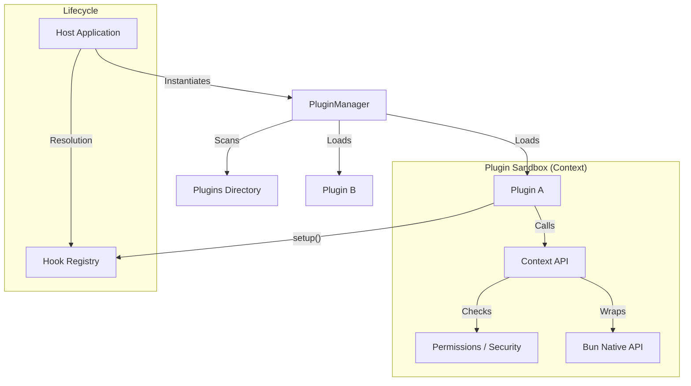

# Bun Plugins System Specification

## Overview

This document outlines the architecture, data structures, and lifecycle of the Bun Plugin System.

## 1. Plugin Structure

Each plugin MUST adhere to the `IPlugin` interface.

### Metadata

- **`name`** (Required): Unique identifier for the plugin (e.g., `my-plugin`).
- **`version`** (Required): Semantic version string (e.g., `1.0.0`).
- **`description`** (Optional): Brief description of functionality.
- **`author`** (Optional): Author name or contact.

### Configuration

- **`configSchema`** (Optional): A Zod schema defining the configuration structure.
- **`defaultConfig`** (Optional): Default configuration values.
- **Safe Mode**: The system should gracefully handle schema mismatches (e.g., disable plugin or fallback to defaults) to prevent crash loops.

### Lifecycle Methods

- **`onLoad(context: PluginContext)`**: Called when the plugin is activated.
- **`onUnload()`**: Called when the plugin is deactivated or the app shuts down.

### Dependencies

To ensure proper functionality and load order:

- **`dependencies`**: A record of required plugin names and their semantic versions.
- **Load Order**: The `PluginManager` resolves the Directed Acyclic Graph (DAG) of dependencies.
- **Validation**: Strict `semver` checks are performed before loading.

### Permissions & Security

Plugins must explicitly request capabilities.

- **`permissions`**: A list of required permissions (e.g., `network`, `filesystem`, `env`).
- **Isolation Strategy**:
  - **Level 1 (Current)**: Cooperative isolation. Plugins run in main process. API access is gated by wrappers (e.g. `context.network.fetch`).
  - **Level 2 (Planned)**: Process isolation. Plugins run in separate `Bun.Worker` threads. `onLoad` and hooks execute remotely.

## 2. Validation

Plugins are validated at runtime using Zod schemas.

- Invalid plugins are rejected with detailed error messages.
- Plugins providing `configSchema` will have their configuration validated automatically.

## 3. Storage System

Each plugin is provided with an isolated storage mechanism.

- **Namespace**: `storage/plugins/<plugin_name>/`
- **Capabilities**:
  - `get<T>(key: string, defaultValue?: T): Promise<T | undefined>`
  - `set<T>(key: string, value: T): Promise<void>`
  - `delete(key: string): Promise<void>`
  - `clear(): Promise<void>` (Scoped to the plugin)

## 4. Plugin Management

The `PluginManager` handles:

- **Discovery**: Scanning directories for plugins.
- **Registration**: Validating and registering plugins.
- **Dependency Resolution**: Calculating the topological sort order for loading.
- **Activation/Deactivation**:
  - Plugins can be persistently enabled/disabled via a global `plugins.json` manifest.
  - `enable(pluginName)`: Loads the plugin (and ensures dependencies are loaded).
  - `disable(pluginName)`: Unloads the plugin.

## 5. Hooks System (Interception)

To support active modification of system behavior (compatible with Bun/esbuild), plugins can register hooks:

- **`setup(build: PluginBuilder)`**: Method to register load filters or other build-time hooks.
- **Execution Model**:
  - Currently: Hooks are registered in the Manager. The Host Application must explicitly call `manager.runOnResolve` / `runOnLoad` or bridge them to `Bun.plugin`.
  - Future: Pipeline execution (waterfall) for conflicting hooks. Currently "First Match / Priority" wins.
- **Hooks**:
  - `onResolve`: Change how a module is located.
  - `onLoad`: Change the content of a loaded module.

## 6. Error Handling & "Panic Recovery"

- **Isolation Zones**: If `onLoad` fails, the plugin is marked as `FAILED`.
- **Timeouts**: Strict timeout (default 5s) for `onLoad`.
- **Resource Tracking**: The `PluginManager` maintains a registry of resources (workers, timers) created via `context` and forces termination on `unload` or failure.

## 7. Inter-Plugin Communication (IPC) & Events

Plugins can interact via:

- **Shared API**: `context.getPlugin(name)` returns the `getSharedApi()` result of another plugin.
- **Event Bus (Planned)**:
  - Global Pub/Sub system.
  - Channels: `file:changed`, `plugin:start`, etc.
  - Methods: `context.events.emit`, `context.events.on`.

## 8. Observability

- **Logging**: Dedicated `logger` in `PluginContext` (`context.log.info`) for namespaced logging.
- **Metrics**: Performance tracking (e.g. `performance.now()`) for initialization and hook execution times.

## 9. Architecture Diagram (Concept)



## 10. Implementation Details

### Updated `IPlugin` Interface

```typescript
import { z } from "zod";

interface IPlugin {
  name: string;
  version: string;
  description?: string;

  // Configuration
  configSchema?: z.ZodSchema;
  defaultConfig?: Record<string, any>;

  // Dependencies
  dependencies?: Record<string, string>; // { "auth-plugin": "^1.2.0" }

  // Permissions (Security)
  permissions?: ("network" | "filesystem" | "env")[];

  // Lifecycle
  onLoad(context: PluginContext): void | Promise<void>;
  onUnload(): void | Promise<void>;

  // System Configuration Hook (Bun/esbuild style)
  setup?: (build: PluginBuilder) => void | Promise<void>;

  // Shared API (IPC)
  getSharedApi?: () => unknown;
}
```

### Plugin Context

```typescript
interface PluginContext {
  manager: PluginManager;
  storage: PluginStorage;
  config: any;

  // Event System
  events: {
    emit(event: string, payload: any): void;
    on(event: string, callback: (payload: any) => void): void;
  };

  // Access to other plugins
  getPlugin(name: string): unknown | undefined;

  // Observability
  log: Console; // Namespaced wrapper

  // Resource Management (Auto-cleaned)
  createWorker(url: string | URL, options?: WorkerOptions): Worker;
  setTimeout(fn: Function, delay: number, ...args: any[]): number;
  // ... other timers / network wrappers
}

// Placeholder for Builder interface
interface PluginBuilder {
  onResolve(filter: RegExp, callback: (args: any) => any): void;
  onLoad(filter: RegExp, callback: (args: any) => any): void;
}
```

## 11. Public API

The package exports the following core components via `src/index.ts`:

- **`PluginManager`**: Main class for management.
- **`IPlugin`, `PluginContext`, `PluginBuilder`**: Core interfaces.
- **`JsonPluginStorage`**: Storage implementation.
- **`pluginValidator`**: Utilities for validating plugin schemas.
